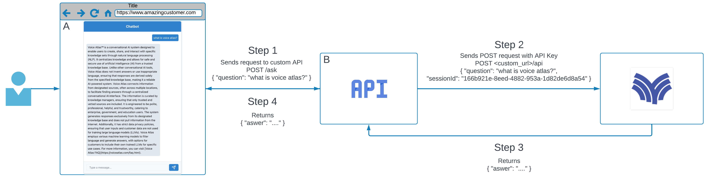

# Voice Atlas API Key integration example

## Overview

This example includes a frontend and a backend that can be used to interact with Voice Atlas API Key integration.

The frontend is written in React/Typescript/ChakraUI
The backend is written in Python with FastAPI

## Architecture

## Usage

1. Clone this repository
2. Open a terminal
3. `cd frontend`
4. `npm install`
5. `npm run start`
6. Open a new terminal o a tab
7. `cd backend`
8. `pip install -r requirements.txt`
9. `uvicorn main:app --reload`
